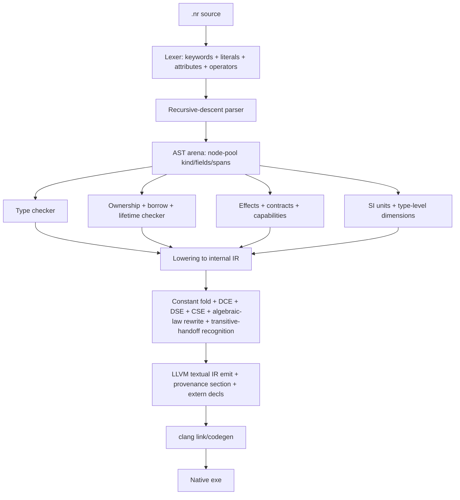

# Nucleor — Complete Feature Inventory

**Version:** 1.0.0
**Date:** 2026-05-08
**Scope:** Every shipping language feature, compiler subsystem, runtime helper, and standard-library rod in the Nucleor distribution. This document is the authoritative reference; the README is the marketing surface that points here.

---

## 1. What Nucleor is

Nucleor is a **self-hosted systems language with an industrial scientific-computing runtime built in**. The compiler is ~50,000 lines of Nucleor source (`compiler/nucleor_s1_compiler.nr` + `compiler/nucleor_tools_suite.nr` + the new RFC-0063 shared-helpers files), rebuilds itself from a committed `.ll` seed in a few seconds, and emits LLVM IR linked through `clang` to a native binary.

The standard library is **~250 rods** (`stdlib/rods/*.nr` — the modules you `import`) backed by **190 runtime C source files** (`stdlib/runtime/*_rt.c`). The full ABI surface — every helper the compiler can emit calls to — is **875 `__nucleor_*` symbols** organized into 17 effect-tagged classes.

Nucleor's identity:

- **Compact systems language with Rust-adjacent syntax.** Functions, structs, enums, traits, impls, generics, where-clauses, lifetimes, ownership, references, pattern matching, contracts, attributes, async/atomic/effect rows, type aliases, type-level units, modules.
- **Self-hosted from day one.** No bootstrap language to keep in sync. The compiler IR fixed-point is checked on every commit (T1.8 verify gate).
- **Real scientific-computing stack, not a toy.** Linear algebra (LU/QR/Cholesky/eigen/SVD), tensor decompositions (CP-ALS, TT-SVD), sparse solvers (CG/GMRES), FFT, signal processing, statistics, ODE/PDE/Bayesian/MCMC, control systems, full-state quantum simulator, robotics planning, modern ML (Mamba/RWKV/xLSTM/MoE/GNN), Black-Scholes + Greeks. Every rod is a real, tested API surface — not a stub.
- **Memory safety as a first-class language guarantee.** All 11 RFC-0062 gates closed at hard-error severity in v1.0: borrow checking, single-input lifetime enforcement, IR-level use-after-drop, conditional-move tracking, definite-assignment flow analysis, heap-aliasing through Vec<&T>/HashMap mutation, Sendable closure propagation, FFI null contract, FFI bounds-check discipline, unsafe-block audit, effect annotations.
- **Production-grade toolchain.** Self-host fixed-point gate, drift gates (helper manifest, rod manifest, RELEASES, CHANGELOG↔tag, parser-fn parity, version-label↔CHANGELOG), perf budget enforcement, mojibake-clean source enforcement, six-class compiler help-coverage check, real-world driver smoke (`PROBE-1`), 4-pipeline ML parity gate against sklearn (`PROBE-2`).

---

## 2. Language core

### 2.1 Syntax surface



**Top-level item classes:** `fn`, `extern fn`, `struct`, `enum`, `type` (alias), `trait`, `impl`, `import`, `const`, `static`, `unsafe { }` blocks (audited via G-7), `#[...]` attributes.

**Functions:** `fn name<G: Bound>(arg: Type, mut a: T) -> Ret where ... { ... }` — generics, multi-trait where-clauses, parameter mutability, named return.

**Lifetimes:** `<'a>` syntax fully parsed; G-2 enforces single-input single-output region equality at error severity (the BORROW-G2-LIFETIME hard-error code, v1.0).

**Pattern matching:** `match` with literal arms, range patterns, struct/enum destructuring, wildcard binding, guards. MATCH-001..014 codes cover the silent-miscompute bug classes.

**Closures:** `|args| body` literal closures + `move |args| body` capture closures. SEND-G6-CLOSURE-CAPTURE (v1.0) enforces Sendable propagation through captured locals at spawn boundaries.

**Async + effect rows:** `with [no_alloc, no_panic, no_dyn]` rows on functions; `#[deadline(N)]` runtime-checked WCET; `#[ffi_no_alloc]` markers; `#[require(...)]` / `#[ensure(...)]` contracts; `result` + `old(...)` in postconditions; `#[invariant(...)]` for impl blocks. Cross-module effect requires-row propagation is enforced (RFC-0033 + RFC-0035).

**Type-level units:** `units::meters(x)` — first-class type-level SI dimensions across mass / length / time / temperature / pressure / energy / force / frequency / voltage / current. Wrong-unit operations are TYP-* errors.

### 2.2 Memory safety — RFC-0062 gates (all closed at v1.0)

| Gate | Code | Phase shipped | Severity |
|---|---|---|---|
| G-1 | auto-drop default-on (Phase 2b-3 default-flip + transitive-handoff) | 2b-3 structural | enforced at lowering |
| G-2 | BORROW-G2-LIFETIME | 4 (R1 of Q-cycle) | error |
| G-3 | ALIAS-G3-VEC-OF-REFS, ALIAS-G3-HASHMAP-REHASH | 3 (R2 of v1.x) | error |
| G-4 | OWN-G4-USE-AFTER-DROP | 4 (Q2) | error |
| G-5 | FFI-G5-NULL-DEREF | 4 (R4) | error |
| G-6 | SEND-G6-HASHMAP, SEND-G6-CLOSURE-CAPTURE, SEND-G6-TUPLE, SEND-G6-ENUM | 3 (R2) | error |
| G-7 | UNSAFE-G7-MISSING-ALLOW | 4 (R4) | error |
| G-8 | OWN-G8-COND-MOVE | 4 (Q3) | error |
| G-9 | FFI-G9-MISSING-ALLOW-DIRECT-FFI | 4 (R4) | error |
| G-10 | EFFECT-G10-UNDECLARED, EFFECT-G10-MISSING-ALLOW, EFFECT-G10-WRONG-ROW | 2b framework (R3) | error |
| G-11 | INIT-G11-READ-BEFORE-INIT | 4 (Q4) | error |

Plus the legacy borrow checker (BR-7..BR-N), ownership tracker (OWN-001..018), type checker (TYP-001..030+), match diagnostics (MATCH-001..014), runtime contract diagnostics (RT-001..010, CONTRACT-001..011), atomic discipline (ATOMIC-001..006, RACE-001..005), assume-blocks (ASSUME-001..005), effect rows (R05/R06), realtime/embedded constraints (RT-005 ffi-from-rt-fn, RT-008 direct-recursion-in-deadline, RT-001..004 effect-row violations).

### 2.3 Effects framework (RFC-0062 effects extension, G-10)

**Attribute syntax:**
```nr
#[effect(frees, may_return_null)]      // declare effects produced
#[allow_effect(direct_ffi)]            // silence one effect on this fn
fn read_blob(path: str) -> *const u8 { ... }
```

**Initial vocabulary:** `frees`, `borrows_mut`, `may_return_null`, `direct_ffi`, `unsafe`. Extensible — add a token to `g10_attr_known_effect` and a leaf-inference rule.

**Inference:**
- **Pass A — leaf builtins:** `vec_free` / `hashmap_free` / `str_free` → `frees`. Extern fn calls → `direct_ffi`. Extern fns returning `*const T` / `*mut T` → `may_return_null`. `unsafe { }` blocks → `unsafe`.
- **Pass B — call propagation:** callee's `#[effect(...)]` row contributes to caller's produced set.
- **Pass C — G-5 deref dataflow:** bindings initialized from `may_return_null` extern fns are flagged on the `own` env; uses without a dominating `ptr_is_null(<binding>)` guard fire FFI-G5-NULL-DEREF. The guard-state lattice intersects at if/else joins via `own_merge_moved` (same primitive G-11 uses for definite-assignment).

**Three contract violations:**
- `EFFECT-G10-UNDECLARED` — body produces effect E but the fn carries no `#[effect(...)]` row and no `#[allow_effect(E)]` opt-out.
- `EFFECT-G10-MISSING-ALLOW` — fn HAS `#[effect(...)]` but body produces an extra effect E that's not in the row and not silenced.
- `EFFECT-G10-WRONG-ROW` — fn declares effect E but body produces no operation that yields E (over-declaration).

**FFI specializations** (R4): when the unhandled effect is `direct_ffi`, `may_return_null`, or `unsafe`, the diagnostic supersedes the generic EFFECT-G10-* with the more specific FFI-G5-* / FFI-G9-* / UNSAFE-G7-* code + per-effect message.

Spec: `docs/rfcs/RFC-0062-effects-extension.md`.

### 2.4 Contracts (`#[require]` / `#[ensure]`)

```nr
#[require(x > 0)]
#[ensure(result == x * x)]
fn square(x: i64) -> i64 { return x * x; }
```

Pre/post-conditions checked at runtime when contract checking is enabled. `old(expr)` references the pre-call value of `expr` in `#[ensure]`. `result` is the function's return value. `#[invariant(...)]` covers struct invariants in impl blocks. Contract diagnostics: CONTRACT-001..011.

### 2.5 Deadline + WCET

```nr
#[deadline = 50]            // 50 µs WCET
#[ffi_no_alloc]
fn step(state: &mut State) { ... }
```

`#[deadline]` requires the body to declare `[no_alloc, no_panic, no_dyn]` effects. The runtime gate (RT-004) aborts at deadline overrun. RFC-0014 covers `max_depth` static analysis + runtime wrapper for recursion bounds.

### 2.6 Atomics + concurrency

`AtomicBool` + `AtomicI64` types (RFC-0007) with `load` / `store` / `compare_and_swap` ordered ops. Spawn semantics enforced via Sendable propagation (G-6); spawn closures must capture only Sendable types (recursive walker — `g6_closure_walk_capture` — ensures bare-parameter closures stay clean).

### 2.7 Capabilities + governance

`@policy(no_unsafe)` rod-level policies (planned for v1.x). `governance.nr` rod ships AuthorRecord registry round-trip (RFC-0060 Phase 2a). `admit.nr` for admission control. `model_provenance.nr` for ML provenance. `sbom_facade.nr` for software-bill-of-materials emission.

### 2.8 Modules + import system

`import "rod_path";` resolves through the module-graph cache (`*.cachekey` files). Cross-module effect requires-row propagation is enforced (no silent acceptance of `pure fn` calling impure helpers). Recursion-depth protection on import scanning.

### 2.9 FFI

**Extern functions:** `extern fn nuc_foo(a: i64) -> i64;` declares an external symbol. Calls produce `direct_ffi` effect (G-9 enforcement); raw-pointer returns produce `may_return_null` effect (G-5 enforcement). The Rust-bridge rod (`stdlib/rods/rust_bridge/`) demonstrates calling Rust crates (regex, base64, hashing) through `extern "C"` static-library output.

**Python interop:** `stdlib/rods/python.nr` + `python_rt.c` — opt-in Python rod. Adopters who don't `import "stdlib/rods/python.nr"` carry zero Python dependency.

---

## 3. Compiler architecture

### 3.1 Compilation pipeline

```mermaid
flowchart LR
    SRC[".nr source"] --> LEX[Lexer]
    LEX --> TOK[Token stream]
    TOK --> PARSE[Recursive-descent parser]
    PARSE --> AST[AST arena]
    AST --> CLOS[Closure/async pre-pass]
    CLOS --> TYPE[Type check]
    CLOS --> OWN[Ownership/borrow/lifetime check]
    CLOS --> CONTRACT[Contracts/effects]
    TYPE --> LOWER[Lowering]
    OWN --> LOWER
    CONTRACT --> LOWER
    LOWER --> IR[Internal IR: blocks/regs/labels]
    IR --> FOLD[Constant fold]
    FOLD --> DCE[Dead-code elim]
    DCE --> PROP[Propagation]
    PROP --> DSE[Dead-store elim]
    DSE --> CSE[Common subexpr elim]
    CSE --> LAW[Algebraic-law rewrite hook]
    LAW --> AUTODROP[Auto-drop injection: G-1 default-on + transitive-handoff recognition]
    AUTODROP --> LLIR[LLVM textual IR]
    LLIR --> EXTERN[Extern declarations + provenance section]
    EXTERN --> CLANG[clang link/codegen]
    CLANG --> EXE[Native exe]
```



### 3.2 Major subsystems

| Subsystem | Implemented surface |
|---|---|
| Lexer | Keywords, identifiers, literals (int/float/str/char/bool), attributes, comments, operators, raw unsupported-syntax diagnostics. Mojibake-clean enforced by `tools/check_mojibake.sh`. |
| Parser | Functions, structs, enums, traits, impls, expressions, statements, matches, generics with where-clauses, let/if/while/for/return, lifetimes, contracts, attributes, async/atomic/effect rows. |
| AST | Arena-style node pool. Compact `(kind, field0, field1, ..., span)` records. |
| Type system | Primitives (i8/i16/i32/i64/u8/u16/u32/u64/f32/f64/bool/char/str), containers (Vec/HashMap/HashSet/BTreeMap/BTreeSet/VecDeque/Box/String), references (`&T` / `&mut T`), units (type-level SI), aliases, generics, signatures. |
| Ownership | Move/copy tracking, shared/mutable borrow tracking, scope-release semantics, ref-target tracking, conditional-move lattice (G-8). |
| Lifetimes | `<'a>` parsing, single-input single-output region check (G-2). |
| Effects | Effect rows (no-alloc, no-panic, no-dyn, no-ffi), atomic contracts, ISR/deadline/depth constraints, effect-annotations framework (G-10). |
| Contracts | `#[require]`, `#[ensure]`, `old(...)`, `result`, `#[invariant]`. |
| Lowering | AST → register/label IR, branch/loop/match lowering, closure lowering, auto-drop injection. |
| Optimization | Constant folding, propagation, DCE, dead-store elimination, CSE, algebraic-law rewrite hook (RFC-0031), transitive-handoff recognition for kind-7 fn calls (closes the move-into-struct-field auto-drop bug class). |
| Backend | LLVM IR emission, extern declarations, string constants, provenance section, clang invocation. |
| Runtime interface | 875 `__nucleor_*` symbols across 17 effect-tagged classes. |
| Module handling | Import scanning, module-graph manifests/cache IDs, recursion depth protection. |

### 3.3 Optimization passes

- **Constant folding:** integer + float arithmetic, comparison, logical ops on literal operands.
- **Propagation:** copy + constant propagation through SSA-shaped temporaries.
- **DCE:** removes unreachable basic blocks + unused defs.
- **DSE:** dead-store elimination for redundant writes to the same slot.
- **CSE:** common-subexpression elimination across basic blocks within a function.
- **Algebraic laws (RFC-0031):** built-in arithmetic identities (`x + 0 → x`, `x * 1 → x`, `x - x → 0`, etc.) are optimized today. `@law(...)` annotations are captured and surfaced for audit; user-law-driven rewrites + generated property tests are tracked for v1.x.
- **`@hot` attribute:** enforces no-heap, no-format, no-indirect-dispatch in the function body.
- **Transitive-handoff recognition:** kind-7 fn-call recognition in `auto_drop_mark_constructor_handoffs` closes the move-into-struct-field handoff class structurally for the entire stdlib (was a silent-miscompute bug class pre-v1.0).

### 3.4 Diagnostic surface

170+ diagnostic codes with span-aware caret pointing. Codes are namespaced by gap class:

- **Type / parse:** TYP-001..030+, NR020 (parse_primary class), MATCH-001..014, NUM-001..024, FMT-001..003, TRAIT-001
- **Ownership / borrow / lifetime:** OWN-001..018, OWN-G4-USE-AFTER-DROP, OWN-G8-COND-MOVE, BORROW-G2-LIFETIME, BR-7
- **Init / DA flow:** INIT-G11-READ-BEFORE-INIT, TYP-008
- **Heap aliasing:** ALIAS-G3-VEC-OF-REFS, ALIAS-G3-HASHMAP-REHASH
- **Sendable / spawn:** SEND-G6-HASHMAP, SEND-G6-CLOSURE-CAPTURE, SEND-G6-TUPLE, SEND-G6-ENUM, RACE-001..005
- **FFI:** FFI-G5-NULL-DEREF, FFI-G9-MISSING-ALLOW-DIRECT-FFI, FFI-NULL, FFI-DIRECT
- **Unsafe:** UNSAFE-G7-MISSING-ALLOW
- **Effects:** EFFECT-G10-UNDECLARED, EFFECT-G10-MISSING-ALLOW, EFFECT-G10-WRONG-ROW
- **Realtime / embedded:** RT-001..010, CONTRACT-001..011, ASSUME-001..005, ATOMIC-001..006
- **Audit-pass / build-summary visibility (Phase A warnings):** ALIAS-G3, OWN-012, FFI-NULL, FFI-DIRECT, SEND-G6, SEND-G6-CLOSURE, UNSAFE-G7

`nuc explain CODE` prints a full description of any diagnostic.

### 3.5 Help-coverage gate

`tools/verify.sh` step "help-coverage" enforces that every dispatched CLI command in `nuc help` has an entry. Six-class compiler help-coverage check ensures no silently-undocumented subcommands.

### 3.6 Self-host fixed-point gate

T1.7 + T1.8 verify gates:
- T1.7: `nucleor build compiler/nucleor_s1_compiler.nr -o _seed_check` produces `target/_seed_check.ll` with sha256 matching `bootstrap/nucleor_s1_seed.ll`.
- T1.8: `tools/check_self_host_md5.sh` builds stage1 from the seed binary, builds stage2 from stage1, verifies stage1.ll md5 == stage2.ll md5 == seed.ll md5.

v1.0.0 fixed-point md5 = `e01aaf1a99c1580c396dec59aa9543ba`.

### 3.7 Drift gates

`tools/check_compiler_drift.sh` enforces six parity gates on every commit:

1. s1 ↔ tools-suite ABI table parity (`get_rt_name`, `is_ptr_ret`, `is_ptr_arg`, IR `declare`)
2. s1 ↔ tools-suite compiler identity parity + checked-in binary identity parity
3. `helper_manifest.toml` freshness vs `gen_helper_manifest.nr` output
4. `rod_manifest.toml` freshness vs `gen_rod_manifest.nr` output
5. `RELEASES.md` freshness vs `gen_releases_index.nr` output
6. CHANGELOG ↔ git-tag parity (every `v*` tag must have a `## [version]` heading)

Plus a `compiler_version_label()` ↔ CHANGELOG.md latest heading parity check.

---

## 4. Runtime + ABI surface

875 `__nucleor_*` runtime symbols organized into 17 effect-tagged classes (per `docs/rfcs/helper_manifest.toml`):

| Class | Count | Purpose |
|---|---|---|
| **PureMath** | 181 | Pure mathematical functions (no I/O, no allocation, no panic): trig, exp/log, hyperbolics, gamma/digamma, erf/erfc, special functions, bit ops, float predicates. |
| **StringFormat** | 131 | String formatting / conversion / parsing helpers — `int_to_str`, `f64_to_str`, `bool_to_str`, parse families, format!() expansion machinery. |
| **VectorOps** | 113 | `Vec<T>::{push, pop, get, set, len, insert, remove, clear, free}` per-type families (Phase A; v1.x consolidates via real generics per RFC-0063 Track 3). |
| **PanickingArith** | 101 | Integer arithmetic with overflow-trap behavior — `add_strict`, `mul_strict`, `i32::MIN / -1` panic-on-overflow, etc. |
| **IO** | 73 | File / network / stdio / process — `file_read`, `file_write`, `socket_*`, `process_*`, `stdin_*`, `stdout_*`. |
| **Collection** | 56 | HashMap, HashSet, BTreeMap, BTreeSet, VecDeque ops. |
| **TensorOps** | 45 | Tensor creation, shape, reshape, broadcast, elementwise, reductions, matmul. |
| **Concurrency** | 40 | Thread spawn/join, mutex, atomic load/store/CAS, MPSC/SPSC queues, condvar. |
| **ADT** | 22 | Option/Result sum-type accessors. |
| **ToolingMeta** | 21 | Compiler-tool meta helpers (used only by tools_suite). |
| **Time** | 21 | Wall-clock, monotonic, sleep, duration arithmetic, timezone. |
| **Introspection** | 19 | `sizeof_*` compile-time queries, type-info reflection. |
| **DataCodec** | 19 | Binary serialization, base64, hex, JSON-low-level. |
| **Allocation** | 14 | Raw malloc/free, aligned-alloc, arena ops. |
| **Random** | 13 | PRNG seeding + uniform/normal/poisson generators. |
| **ControlFlow** | 6 | `contract_check`, `deadline_check`, `max_depth_*`, `unreachable!()`. |

Every helper carries metadata: purity, panic class, allocation class, effect row. The 17-class taxonomy reached zero unclassified at v0.8.323 (RFC-0063 Phase 1 milestone) and remains tight through v1.0.

---

## 5. Standard library — by category

### 5.1 Numerics + linear algebra

- **`complex`** — `Complex<f64>` with arithmetic, polar form, `exp` / `log` / `sqrt` / `pow` / trig over the complex field.
- **`math`** — IEEE 754 trig, exponentials, hyperbolics, special functions (gamma, digamma, beta, erf/erfc), absolute value, sign, floor/ceil/round/trunc, hypot, atan2, fmin/fmax/copysign, isnan/isinf/isfinite, fabs, ldexp/frexp/modf.
- **`math_typed`** — type-level dimensioned math (works with `units::*` types so `meters * seconds` is type-checked away).
- **`math_typed_special`** — special functions with dimensional-correctness guards.
- **`linalg`** — LU + LU-pivot, QR (Householder + Givens), Cholesky, eigen (symmetric + general), SVD (full + thin), condition number, matrix inversion, determinant, rank, pseudo-inverse, triangular solve, back-/forward-substitution, generalized least-squares.
- **`tensor_nd`** — N-dimensional tensors with shape, strides, broadcast, reshape, transpose, slice, gather, scatter, einsum-shape inference, elementwise + reduction kernels, matmul with shape-checked dispatch.
- **`tensor_decomp`** — CP-ALS (canonical polyadic decomposition via alternating least squares), TT-SVD (Tensor-Train decomposition), Tucker decomposition.
- **`sparse`** — CSR (compressed-sparse-row) sparse matrices with CG (conjugate gradient), GMRES (generalized minimum residual), preconditioned variants.
- **`fft`** — 1D FFT (Cooley-Tukey, mixed-radix), real FFT, inverse FFT, 1D convolve, power spectrum, zero-padded transform sizes, Bluestein for prime lengths.
- **`bigint`** — arbitrary-precision integers with karatsuba multiplication, modular exponentiation.
- **`bitwise` / `bits`** — bit manipulation primitives (popcount, leading/trailing zeros, byte swap, bit reverse).
- **`fixed_point`** — Q-format fixed-point arithmetic for embedded targets.
- **`taylor`** — validated Taylor-arithmetic ODE integrator with rigorous interval bounds (used in the Boussinesq + NS proof workstreams).
- **`interval`** — rigorous interval arithmetic with directed rounding.

### 5.2 Numerical methods

- **`ode`** — Euler, RK4, RK45 (adaptive Cash-Karp), symplectic integrators (Verlet, leapfrog), implicit-Euler, BDF.
- **`root`** — bisection, Newton, secant, Brent (Dekker–Brent hybrid), halley.
- **`quad`** — trapezoidal, Simpson, Gauss-Legendre, adaptive Gauss-Kronrod, Romberg, Monte-Carlo, importance-sampled MC.
- **`interp`** — linear, cubic spline, Lagrange, Chebyshev, RBF (radial basis function), Akima.
- **`bspline`** — B-spline evaluation + KAN (Kolmogorov-Arnold network) forward pass.
- **`cspline` / `cubicspline`** — natural + clamped + not-a-knot cubic splines.
- **`catmullrom`** — Catmull-Rom interpolation for smooth spatial paths.
- **`bezier`** — Bezier curves (quadratic + cubic + general) with de Casteljau eval + arc-length parameterization.
- **`optim`** — gradient descent, Adam, simplex (Nelder-Mead), line search (Wolfe + backtracking), genetic algorithm, simulated annealing, BFGS, L-BFGS.
- **`differentiable`** — generic differentiable-programming substrate (used by autodiff + nn_autodiff).

### 5.3 Statistics + signal

- **`stats`** — descriptive (mean/median/var/std/skew/kurtosis), regression (linear, polynomial, ridge), t-test (one-sample + two-sample + paired), χ² (goodness-of-fit + independence), KDE (kernel density estimation, Gaussian/Epanechnikov/uniform), bootstrap CI.
- **`ridge`** — ridge regression with cross-validated λ selection.
- **`signal`** — FIR + IIR + Butterworth filter design, window functions (Hann/Hamming/Blackman/Kaiser), STFT, resample, decimate.
- **`pca`** — PCA fit + project, incremental PCA.
- **`bayesian`** — MCMC samplers (Metropolis-Hastings, NUTS), prior + likelihood + posterior pipeline.
- **`dtw`** — Dynamic Time Warping with banded constraint.

### 5.4 PDE + physics simulation

- **`multigrid`** — multigrid Poisson solver (V-cycle + W-cycle + full multigrid), restriction/prolongation operators.
- **`fluid`** — Lattice Boltzmann method (D2Q9 + D3Q19) for Navier-Stokes simulation, BGK + MRT collision operators.
- **`emag`** — FDTD (Finite-Difference Time-Domain) Maxwell solver with PML boundaries.
- **`thermo`** — heat equation solver, ideal gas law, Carnot cycle, radiation transport.
- **`geom`** — vector + matrix geometry primitives: dot, cross, norm, project, reflect, rotate, distance.
- **`rigid_body`** — 3D rigid-body dynamics: inertia tensor, angular momentum, quaternion integration.
- **`orbit`** — orbital mechanics: Kepler's equation solver, Hohmann transfer, vis-viva, J2 perturbation.
- **`dynamics`** — generic dynamical-system abstractions.

### 5.5 Constants + units

- **`physics`** — 17 CODATA 2018 fundamental constants: c, h, ℏ, e, kB, NA, R, G, ε₀, μ₀, αₑ, mₑ, mₚ, mₙ, atomic mass unit, Stefan-Boltzmann, Wien displacement.
- **`units`** — SI unit conversion across 9 dimensions: mass, length, time, temperature, pressure, energy, force, frequency, voltage, current. Type-level — `(5 * meters) / (2 * seconds)` produces a `velocity` type checked at compile time.
- **`numeric`** — numeric type families and conversions.
- **`overflow`** — overflow-safe arithmetic operations.

### 5.6 Symbolic + autodiff

- **`autodiff`** — reverse-mode automatic differentiation with tape recording.
- **`symbolic`** — symbolic expression trees, simplification, differentiation, substitution.
- **`differentiable`** — generic differentiable substrate.
- **`nn_autodiff`** — autodiff specialized for neural networks (graph optimization).
- **`transformer_autodiff`** — autodiff specialized for transformer layers.

### 5.7 Control + estimation

- **`control`** — PID + Kalman filter (linear + extended) + state-space models (continuous + discrete).
- **`pidc`** — discrete PID with anti-windup + derivative kick suppression.
- **`lqr`** — Linear Quadratic Regulator (continuous + discrete + finite-horizon).
- **`mpc`** — Model Predictive Control with constraint handling (QP-based).
- **`mppi`** — Model Predictive Path Integral control (sampling-based for nonlinear systems).
- **`ilqr`** — Iterative LQR (DDP variant for trajectory optimization).
- **`cilqr`** — Constrained iLQR with augmented Lagrangian.
- **`ddp`** — full Differential Dynamic Programming.
- **`ekf`** — Extended Kalman Filter (Jacobian-based).
- **`ukf`** — Unscented Kalman Filter (sigma-point based).
- **`pgs`** — Projected Gauss-Seidel solver for LCP/MCP.
- **`pgs3`** — 3-DOF specialization.

### 5.8 Robotics

**Kinematics + dynamics:**
- **`kinematics`** — Vec3, quaternion, Pose3, Twist, Wrench, SE(3) operations.
- **`kinematics_frame` / `kinematics_transform`** — frame-tagged transforms with type-checked composition (ROBO-7 Transform<From,To> facade).
- **`fk_chain`** — forward kinematics with DH (Denavit-Hartenberg) parameters.
- **`ik_dls`** — inverse kinematics with damped least squares (3-DOF + 6-DOF + joint limits + singularity detection).
- **`dynamics`** — manipulator dynamics (Newton-Euler + composite-rigid-body algorithm).
- **`hwbc` / `wbc`** — whole-body control, hierarchical / standard.
- **`zmp`** — Zero Moment Point computation for biped balance.

**Trajectory generation:**
- **`trajectory`** — quintic, trapezoidal, S-curve, DMP (Dynamic Movement Primitive), TOPP (Time-Optimal Path Parameterization).
- **`scurve` / `trapvel`** — S-curve and trapezoidal velocity profiles.
- **`qtraj`** — quaternion trajectory generation (SLERP + smooth interpolation).
- **`topp`** — time-optimal path parameterization on dynamics.
- **`apf`** — Artificial Potential Field navigation.

**Planning + path search:**
- **`rrt`** — RRT, RRT-Connect, RRT*, goal-region biased.
- **`prm`** — Probabilistic Roadmap + Dijkstra query.
- **`astar`** — A* on grids and graphs.
- **`dstar`** — D* Lite for replanning under partial observability.
- **`dwa`** — Dynamic Window Approach for local planning.
- **`dubins` / `reeds_shepp`** — non-holonomic shortest paths.
- **`stanley` / `purepursuit` / `pursuit`** — path-following controllers for vehicles.
- **`vfh`** — Vector Field Histogram obstacle avoidance.
- **`mppi`** — sampling-based MPC (also under control).
- **`wavefront`** — wavefront grid planner.
- **`fsp`** — Field-Space Planning.

**Vehicle models:**
- **`bicycle`** — bicycle / kinematic-bicycle model.
- **`mecanum`** — mecanum-wheel inverse kinematics.
- **`skid_steer`** — skid-steer differential drive.
- **`diff_drive`** — differential drive with velocity / pose state.
- **`diff_sim`** — differentiable simulation step (for learning controllers).

**Estimation + sensing:**
- **`ekf` / `ukf`** — Kalman filters (also under control).
- **`ahrs`** — Attitude / Heading Reference System (gyro + accel + mag fusion).
- **`pf`** — particle filter.
- **`ba`** — Bundle Adjustment.
- **`pcalign`** — point-cloud alignment.
- **`icp` / `icp_p2p`** — Iterative Closest Point (point-to-point + point-to-plane).
- **`scanmatch`** — scan-matching for lidar localization.
- **`occgrid` / `sgrid`** — occupancy grid mapping.
- **`voxel`** — voxel grid representations.
- **`pnp`** — Perspective-n-Point.
- **`handeye`** — hand-eye calibration.
- **`reach`** — reachability analysis.
- **`grasp`** — grasp synthesis primitives.
- **`mobile`** — mobile-base abstractions.

**Vision feature detection:**
- **`harris`** — Harris corner detector.
- **`fast_corner`** — FAST corner detector.
- **`klt`** — Kanade-Lucas-Tomasi feature tracking.
- **`canny`** — Canny edge detector.
- **`sobel`** — Sobel gradient.
- **`hough` / `hough_circle`** — Hough line + circle transform.
- **`ransac`** — RANSAC robust estimation.
- **`hull`** — convex hull (Graham scan + Quickhull).
- **`delaunay`** — Delaunay triangulation.
- **`voronoi`** — Voronoi diagram.

**Geometry + mesh:**
- **`mesh`** — finite-element rectangular meshes + tetrahedral.
- **`sdf`** — Signed Distance Field representation + operations.
- **`bvh`** — Bounding Volume Hierarchy for broad-phase pruning.
- **`octree` / `kdtree` / `kdt`** — spatial indices.
- **`collision`** — sphere/capsule/AABB/OBB pairs + GJK + EPA penetration depth + CCD (continuous collision detection).
- **`urdf`** — URDF (Universal Robot Description Format) parser → FK chain.
- **`rdp`** — Ramer-Douglas-Peucker simplification.

**Robot-specific:**
- **`bt`** — behavior tree implementation.
- **`twin_core`** — digital-twin substrate.
- **`twin_core` / `quantum_twin`** — twin-based simulation cores.
- **`energy_budget`** — robot energy-budget tracking.
- **`target_caps`** — target-platform capabilities matrix.

### 5.9 Modern ML

**Core neural-network rods:**
- **`nn`** — Dense + Adam optimizer + attention + ensemble methods.
- **`nn_autodiff`** — autodiff specialized for NN computation graphs.
- **`gnn`** — GATv2 (Graph Attention Network v2) + global attention pool.
- **`ssm`** — Mamba selective scan + RWKV (Receptance Weighted Key Value) + xLSTM + ZOH (Zero-Order Hold).
- **`moe`** — top-k gate + expert dispatch + load balancing.
- **`activation2`** — second-generation activation functions (GELU, SwiGLU, Mish, Squareplus, ReGLU).
- **`attention2`** — second-generation attention (FlashAttention-shape, ALiBi, RoPE, sliding-window).
- **`transformer`** — full transformer block (multi-head attention + feed-forward + layernorm).
- **`transformer_autodiff`** — transformer with autodiff for training.
- **`autodiff`** — reverse-mode autodiff substrate.

**Training + inference utilities:**
- **`tokenizer`** — BPE / WordPiece / SentencePiece-shape tokenization.
- **`embedding`** — embedding tables + lookup + train.
- **`kv_cache`** — KV cache for transformer inference.
- **`quantize`** — Q4 / int8 / ternary / FP8 quantization with calibration.
- **`rl`** — replay buffer + GAE (Generalized Advantage Estimation) + PPO + DQN.
- **`loss`** — MSE / cross-entropy / huber / focal / contrastive.
- **`speculative`** — LLM speculative decoding.
- **`diffusion`** — diffusion-model sampling (DDPM + DDIM).
- **`ridge` / `pca`** — classical ML primitives.

**ML operational lifecycle (the `ml/` facades, ~30 surfaces):**
- **`ai_facade`** — top-level AI workflow entry point.
- **`backend_facade`** — backend dispatch (CPU / GPU).
- **`bench_facade`** — benchmark harness.
- **`boost_facade`** — boosting ensembles.
- **`capsule_facade`** — model capsule packaging.
- **`cert_facade`** — certificate / attestation emission.
- **`cli_facade`** — CLI dispatch for ML commands.
- **`contract_facade`** — ML-contract enforcement.
- **`data_facade`** — data loading + preprocessing.
- **`dtype_core`** — dtype primitives.
- **`experiment_facade`** — experiment tracking.
- **`gguf_facade`** — GGUF (LLM weight format) read/write.
- **`hf_facade`** — Hugging Face artifact loader.
- **`lab_facade`** — lab-bench experiment management.
- **`learn_facade`** — training loop management.
- **`math_facade`** — ML math primitives.
- **`ml_health_facade`** — ML model health checks.
- **`model_io_facade`** — model serialization.
- **`ncap_facade`** — Nucleor capability profile for ML.
- **`nn_facade`** — neural-network builder.
- **`onnx_facade`** — ONNX import/export.
- **`parity_manifest`** — manifest for ML parity gates (used by PROBE-2).
- **`port_facade`** — model porting tools.
- **`probes`** — PROBE-2 4-pipeline parity gate (DT classification, linear regression, KMeans, BernoulliNB) — v1.0 ship.
- **`rod_registry_facade`** — rod-registry for ML pipelines.
- **`sbom_facade`** — SBOM emission.
- **`serve_facade`** — model serving substrate.
- **`shape_core`** — shape arithmetic.
- **`ship_facade`** — model shipping.
- **`stats_facade`** — ML statistics.

**ML safety + provenance:**
- **`model_provenance`** — model lineage + training-data provenance.
- **`tensor_facade`** (under `ml/`) — typed tensor wrapper.
- **`se3.nr`** — SE(3) lie-group operations (typed tf migration wrapper).
- **`tf.nr`** — typed tensor framework.

### 5.10 Quantum

- **`quantum`** — full state-vector quantum simulator (H, X, Y, Z, S, T, CNOT, CZ, CRK, CCX, SWAP, measurement).
- **`quantum_gates`** — gate library extension (Clifford + non-Clifford).
- **`quantum_twin`** — quantum digital-twin abstractions.
- **`qsim_graph`** — entanglement-DAG tracking + checked gate-DAG recording (closes QM-8 / QM-9 silent-trust gap).
- **`qtraj`** — quantum-trajectory simulation.
- **`qutil`** — quantum utility helpers.
- **`mps`** — Matrix Product States representation + algorithms (TEBD, DMRG, expectation values via `nuc_mps_expect_z`).
- **`clifford`** — stabilizer formalism for quantum error correction.
- **`photonic`** — photonic-quantum-computing primitives.
- **`neuromorphic`** — neuromorphic-quantum-computing primitives.
- **`logical_qubit`** — logical-qubit (encoded) operations.

### 5.11 Finance

- **`finance`** — Black-Scholes (call + put + American + European) with all Greeks (delta, gamma, vega, theta, rho), implied volatility solver (Newton + Brent fallback), NPV, IRR, MIRR, VaR (historical + parametric + Monte-Carlo), CVaR, portfolio optimization (mean-variance + Black-Litterman).

### 5.12 Audio + image + vision

- **`audio`** — WAV read/write, STFT, MFCC, spectrogram, resampling, simple synthesis.
- **`image`** — PPM / BMP read/write, basic convolutions, pixel ops.
- **`image_pyramid`** — Gaussian + Laplacian pyramid for multi-scale ops.
- **`imgproc`** — image processing primitives (blur, threshold, morphology, color conversion).
- **`color`** — color-space conversion (RGB / HSV / LAB / XYZ / sRGB / linear).
- **`vision`** — high-level computer-vision pipelines.
- **`canny` / `sobel` / `harris` / `klt` / `fast_corner` / `hough` / `hough_circle`** — vision feature detectors (also under robotics).

### 5.13 Plotting + graphics

- **`plot`** — SVG output for line plots, scatter plots, bar charts, histograms, heatmaps, contour plots.
- **`graph_render`** — graph-visualization renderer (force-directed layout + SVG output).
- **`graph` / `vgraph`** — graph data structure + algorithms (BFS, DFS, Dijkstra, Bellman-Ford, MST, PageRank).

### 5.14 Data structures + algorithms

- **`collections`** — generic collection abstractions (Vec / HashMap / HashSet / BTreeMap / BTreeSet / VecDeque).
- **`hashmap`, `hashmap_str`, `hashset`, `btreemap`, `btreeset`, `vecdeque`, `queue`, `pqueue`, `stack`, `mpsc_queue`, `spsc_queue`** — concrete container rods with effect-tagged ops.
- **`option` / `result`** — sum-type ADTs with `unwrap` / `unwrap_or` / `map` / `and_then`.
- **`sort`** — quicksort + mergesort + radix sort + intro sort.
- **`string_algo`** — KMP, Levenshtein, Trie, Aho-Corasick, suffix-array.
- **`string_type` / `strings`** — string abstractions + helpers.
- **`fmt`** — format!() expansion machinery and helpers.
- **`bloom`** — Bloom filter + HyperLogLog cardinality estimation.
- **`bm25`** — BM25 ranking function for information retrieval.
- **`kdtree` / `kdt`** — k-d tree for nearest-neighbor search.
- **`hnsw`** — HNSW (Hierarchical Navigable Small World) for approximate nearest-neighbor.
- **`pq`** — product quantization for high-dimensional vector search.
- **`embedding`** — embedding tables (also under ML).

### 5.15 Crypto + codecs + serialization

- **`crypto`** — symmetric ciphers (AES + ChaCha20 + Poly1305), HMAC, KDF (PBKDF2 + scrypt + Argon2), ECDSA / Ed25519 signing.
- **`pq_crypto`** — post-quantum cryptography primitives (Kyber + Dilithium).
- **`base64`** — Base64 encode/decode (URL-safe + standard).
- **`digest`** — hashing primitives (SHA-256, SHA-512, BLAKE3).
- **`compress`** — compression / decompression (gzip, deflate, lz4).
- **`json` / `jsonl`** — JSON read/write, JSON-Lines streaming.
- **`csv` / `csv_table`** — CSV parsing + table abstractions.
- **`ini`** — INI-file parsing.
- **`toml`** — TOML parsing.
- **`regex`** — regular-expression matching (NFA + DFA backends).
- **`uuid`** — UUID v4 + v7 generation.
- **`binary`** — binary serialization primitives.

### 5.16 System + IO

- **`io`** — buffered I/O primitives.
- **`fs` / `fs_extras`** — filesystem operations (read, write, stat, dir walk, glob).
- **`mmap`** — memory-mapped files.
- **`os` / `os_info`** — OS detection, env vars, process info.
- **`env`** — environment variable access.
- **`path`** — path manipulation (cross-platform).
- **`time`, `datetime`, `time_typed`** — wall clock, monotonic, sleep, duration arithmetic, calendar dates, ISO 8601.
- **`log`** — structured logging.
- **`cli`** — command-line argument parsing.
- **`lsp`** — Language Server Protocol scaffolding.
- **`process`** — process spawning + wait.
- **`thread` / `concurrency`** — threads, mutex, condvar, atomic primitives, spawn/join.
- **`multi_core`** — work-stealing scheduler primitives.
- **`distributed`** — distributed-computing abstractions.
- **`comm`** — collective-communication primitives (allreduce + broadcast + scatter + gather).
- **`socket`** — TCP + UDP sockets.
- **`atomic`** — atomic reference primitives.
- **`serial`** — serial-port I/O.
- **`memspace`** — memory-region abstractions.
- **`mem`** — low-level memory primitives.
- **`allocator`** — pluggable allocator.
- **`enclave`** — secure enclave abstractions.

### 5.17 Test + benchmarking

- **`test`** — `#[test]` annotation runner, assertion library.
- **`asserts`** — `assert_eq!`, `assert_ne!`, `assert!`, `unreachable!()` with canonical panic messages.
- **`bench_facade`** — benchmark harness (under `ml/`).

### 5.18 Interop

- **`rust` / `rust_bridge`** — Rust crates via C ABI (regex, base64, hashing demonstrations; pattern works for any `extern "C"` static-library output).
- **`python`** — Python interop (opt-in).
- **`gpu`** — GPU dispatch primitives (CUDA + ROCm + Metal targets).
- **`simd`** — SIMD primitives (AVX2 + AVX-512 + NEON).

### 5.19 Specialized + emerging

- **`bioseq`** — biological sequence processing (FASTA/FASTQ parsing, alignment scoring).
- **`chomp`** — covariant ∇F preconditioner (CHOMP trajectory optimization).
- **`replay`** — replay buffer (also under RL).
- **`checkpoint`** — checkpoint serialization for long-running computations.
- **`scan`** — parallel-scan / SSM kernels (also under ML).
- **`state_machine`** — finite state machine substrate.
- **`differentiable`** — differentiable-programming substrate (also under autodiff).
- **`f64_buffer`** — typed f64 buffer abstractions.
- **`numeric_rt`** — numeric runtime helpers.
- **`overflow`** — overflow-safe primitives.
- **`fsp`** — Field-Space Planning.
- **`reach`** — reachability analysis.
- **`pnp`** — Perspective-n-Point (also under robotics).
- **`grasp`** — grasp synthesis (also under robotics).
- **`handeye`** — hand-eye calibration (also under robotics).
- **`twin_core`** — digital-twin substrate (also under robotics).
- **`quantum_twin`** — quantum digital-twin (also under quantum).
- **`logical_qubit`** — logical-qubit ops (also under quantum).

---

## 6. Build + verification toolchain

### 6.1 The `nuc` CLI

| Subcommand | Purpose |
|---|---|
| `nuc build <file>` | Compile a `.nr` source to native exe via LLVM IR + clang. |
| `nuc run <file>` | Build + run. |
| `nuc test <file>` | Run `#[test]` functions. |
| `nuc check <file>` | Run all checkers (ownership, type, source, taint, effect) without emitting code. |
| `nuc explain <CODE>` | Print the full description of any diagnostic code. |
| `nuc summary <file>` | Print a compilation summary (LOC, externs, helpers used, etc.). |
| `nuc audit <file>` | Run audit-pass diagnostics (count Vec<&T> / extern fns / unsafe blocks / etc.). |
| `nuc query <file>` | Query the AST / IR. |
| `nuc impact <file>` | Compute call-graph impact analysis. |
| `nuc policy <file>` | Apply rod-level policies. |
| `nuc certify <file>` | Emit attestation / certificate. |
| `nuc translate <file>` | Translate AST to alternative representation. |
| `nuc evidence <file>` | Emit provenance evidence. |
| `nuc graph <file>` | Print module graph. |
| `nuc perf <file>` | Print perf summary. |
| `nuc bench <file>` | Run benchmark. |
| `nuc init` | Scaffold a new Nucleor project. |
| `nuc doc <file>` | Generate documentation. |
| `nuc lock` | Write `Nucleor.lock`. |
| `nuc fix <file>` | Apply auto-fixes for a subset of diagnostics. |
| `nuc abi inspect <file>` | Print ABI surface. |
| `nuc verify-reproducible <file>` | Verify byte-identical rebuild. |
| `nuc bootstrap status` | Bootstrap diagnostics. |
| `nuc stage-dump <file>` | Dump per-stage IR. |
| `nuc registry` | Registry operations. |
| `nuc zen` | Print `nuc zen`. |
| `nuc mco <file>` | Module-cache operations. |
| `nuc --version` / `-v` / `-V` / `version` | Print compiler version. |
| `nuc help` | Print help. |

### 6.2 The verify gate (`tools/verify.sh`)

The flagship gate — runs ~1500 steps covering:
1. Binary present + loads
2. ABI parity (s1 ↔ tools-suite, drift gates)
3. Tools-suite rebuild
4. Mojibake clean (UTF-8 sanity)
5. Help-coverage (every dispatched cmd in `nuc help`)
6. Utility smoke (zen / mco / registry / stage-dump / fix)
7. JSON-flag smoke (11 commands)
8. Version aliases (`--version` / `-v` / `-V` / `version`)
9. Showcase build (lorenz / vqe_h2 / market_maker / wing_simulator)
10. CLI: explain (NUM-001 quick-fail canary + full 130-code spec catalog)
11. CLI: bootstrap status + Contract: file resolves
12. CLI: check + abi inspect
13. CLI: summary / audit / query / impact (inspectors)
14. CLI: policy / certify / translate / evidence / graph / perf / bench (diagnostics)
15. CLI: init scaffolding
16. CLI: doc generator
17. CLI: lock writes Nucleor.lock
18. CLI: test runs `#[test]` functions
19-N. Build + run every example under `examples/`
N+1.. Build + run every positive test under `tests/{lang,attrs,runtime,rods,features}`
... Confirm every `tests/err/*.nr` fails with at least a diagnostic line
T1.7 Bootstrap seed matches current compiler
T1.8 Self-host compiler IR fixed point
PROBE-1 Real-world drivers (`nuc build/run/test/check/summary/explain/init/clean`)
PROBE-2 ML pipeline parity (DT + LR + KMeans + NB) — opt-in via `NUC_VERIFY_ML_PROBE=1`

v1.0.0 verify result: PASS=1518 / SKIP=3 / FAIL=0 on Windows.

### 6.3 Strict verify (`tools/verify_strict.sh`)

Same as `verify.sh` plus:
- Cache wipe before run (forces full module recompile per fixture)
- `NUC_VERIFY_STRICT=1` enables additional checks (manual_drop parity audit, etc.)
- Used at integration time (not per-commit) to catch cache-poisoning regressions

### 6.4 Drift gates (`tools/check_compiler_drift.sh`)

Six parity checks (see §3.7).

### 6.5 Self-host fixed-point (`tools/check_self_host_md5.sh`)

Builds stage1 from the seed binary, builds stage2 from stage1, verifies stage1.ll == stage2.ll == seed.ll byte-for-byte.

### 6.6 Performance gates

`tools/perf_baseline.json` + `tools/perf_baseline_linux.json` capture cold + hot compile time + peak RSS. `tools/check_perf_regression.{sh,ps1}` compares current build against baseline. `tools/verify_timings.csv` records per-step timings; any step > 1.3× its baseline triggers investigation.

### 6.7 Manifest generators

- `tools/gen_helper_manifest.nr` — emits `docs/rfcs/helper_manifest.toml` from runtime sources.
- `tools/gen_rod_manifest.nr` — emits `docs/rfcs/rod_manifest.toml` from rod sources.
- `tools/gen_releases_index.nr` — emits `RELEASES.md` from CHANGELOG.md.
- `tools/audit_dup_fns.nr` — emits `tools/audit_dup_fns_report.csv` (parser-fn duplication audit).

All four are native Nucleor (no Python in the toolchain — closed v0.8.323).

---

## 7. Bootstrap + cross-platform

### 7.1 Windows

`tools/bootstrap_windows.ps1` — recovers `bin/nucleor.exe` from `bootstrap/nucleor_s1_seed.ll`. Resolves `clang.exe` from `NUCLEOR_CLANG_PATH`, then `LLVM_SYS_180_PREFIX/bin`, then `C:\Program Files\LLVM\bin`, then plain `PATH`.

### 7.2 Linux

`tools/bootstrap_linux.sh` — equivalent for POSIX hosts. Native Linux perf baseline at `tools/perf_baseline_linux.json`. Full verify gate runs on Linux at parity with Windows.

### 7.3 macOS

Pending hardware availability for the CI gate. Source is portable; the bootstrap script needs to be added.

---

## 8. v1.0 ship summary

**Released:** 2026-05-08
**Self-host fixed-point md5:** `e01aaf1a99c1580c396dec59aa9543ba`
**Verify totals (Windows):** PASS=1518 / SKIP=3 / FAIL=0
**Compiler size:** ~10,000 LOC s1 + ~12,000 LOC tools_suite + ~5,200 LOC RFC-0063 shared-helpers files (wave1 + wave2)
**Stdlib:** ~250 rods (`stdlib/rods/*.nr`)
**Runtime:** 190 C source files (`stdlib/runtime/*_rt.c`)
**Helper ABI:** 875 `__nucleor_*` symbols across 17 effect-tagged classes
**Memory safety:** all 11 RFC-0062 gates closed at hard-error severity (G-1 structural; G-2/4/8/11 from Q1-Q4; G-3/6 from R2; G-5/7/9 from R4; G-10 framework from R3)
**Diagnostic codes:** 170+ with span-aware caret, namespaced by gap class
**Test corpus:** ~1500 fixtures across `tests/{lang,attrs,runtime,rods,features,err,probes}/`
**Effect vocabulary:** `frees`, `borrows_mut`, `may_return_null`, `direct_ffi`, `unsafe`

See `CHANGELOG.md` for the full release notes and the cycle history of Phase A + Q1-Q5 + R1-R4 work that delivered v1.0.

---

## 9. Roadmap (post-v1.0)

Documented residuals (the work that did NOT block v1.0 but is on the v1.x hardening track):

- **RFC-0063 waves 17+:** 69 SIG_MATCH_BODY_DIFFERS + 16 SIG_DIFFERS still in `tools_suite` — large-body fns and adapter-required call-site updates.
- **6 drift-protected fns** intentionally left LOCAL in tools_suite (`get_rt_name`, `is_ptr_ret`, `is_ptr_arg`, `emit_externs`, `emit_user_externs`, `compiler_version_label`) — closing requires teaching `tools/check_compiler_drift.sh` to follow imports.
- **macOS native bootstrap** pending hardware.
- **Per-rod `#[effect(...)]` retrofit** across 216 .nr files / 1786 extern decls in `stdlib/` — adopter-incremental opt-in work.
- **PGO + LTO production binary** — RFC-0063 G4 perf-engineering track.
- **Per-arch SIMD specialization** for hot helpers (AVX-512 + NEON variants for memcpy/memcmp/str-vec batch ops, FP reductions).
- **VectorOps consolidation:** 113 → ~30 via real generics (currently per-type families).
- **StringFormat consolidation:** 131 → ~50 via `Format<T>` trait.
- **G-1 Phase 4** (remove `#[manual_drop]` entirely) — requires the 8 parser fns to migrate to `unsafe { }` blocks or lifetime annotations; not a blocker because Phase 2b-3 default-flip already closes the silent-leak gap.
- **`#[allow(unsafe)]` enforcement** as a stronger Phase 4 promotion of G-7.
- **Real Quantum hardware integration** beyond the state-vector simulator (cloud-quantum APIs).
- **Real-time GC tuning** for the auto-drop pass (currently a single-pass insertion at lowering).

These are tracked in `docs/rfcs/RFC-0062-IMPLEMENTATION-PLAN.md` §2A v1.0 ship status and `docs/rfcs/RFC-0063-production-readiness-roadmap.md`.
